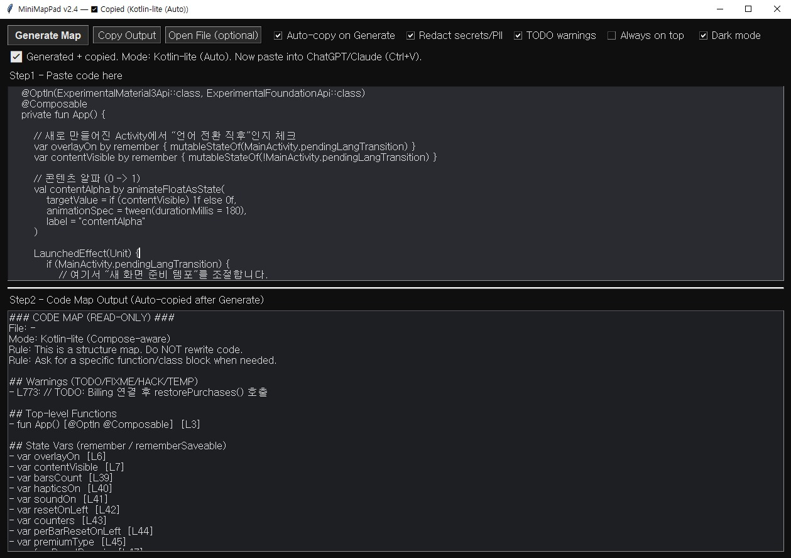

# MiniMapPad — Code Map Generator (Auto Copy)

<p align="center">
  
</p>

Generate a compact **structure map** from long source code, then **auto-copy** it to your clipboard for ChatGPT / Claude / Gemini etc.

**Primary:** Python (AST) / PHP (lite)  
**Secondary:** Kotlin / Java (lite)  
**Workflow:** Paste → Generate → Auto-copy → Paste to LLM

---

## What is a "Code Map"?

When you paste a huge file (1,000–5,000+ lines) into an LLM, it may hallucinate or miss important context. It helps the model ask for the right block instead of guessing from partial context.

MiniMapPad outputs a **read-only structure map**, such as:

- imports / namespace / use
- constants / defines
- functions + line numbers
- classes + methods + line numbers
- (lite) a few call hints (e.g., `->`, `::`)
- optional TODO/FIXME/HACK/TEMP warnings

**Rule:** This is a structure map. Do **NOT** rewrite code.  
**Rule:** Ask for a specific function/class block when needed.

---

## Why This Helps

Pasting large files into an LLM causes two problems: hallucinations increase toward the end of context, and token usage spikes fast. MiniMapPad sends the structure first — then you paste only the specific block the LLM needs.

Real-world reduction examples *(results vary by code structure)*:

| Language | Original | Code Map | Reduction |
|----------|----------|----------|-----------|
| Kotlin (lite) | 1,850 lines | ~118 lines | ~94% |
| Python (AST) | 500 lines | ~50 lines | ~90% |

> Results vary by file structure (import-heavy files often compress well).

---

## Features

- ✅ **Python AST mode** — built on Python's standard `ast` module (not regex). Accurate structure extraction including `async def` functions/methods, private markers, and return types.
- ✅ **PHP lite mode** — regex/token scanning. Extracts `namespace`, `use`, `define/const`, class hierarchy (`extends` / `implements`), method visibility (`pub/pro/pri`), `static` / `abstract`, return type hints, and global functions correctly separated from class methods.
- ✅ **Kotlin lite mode** — Compose-aware. In addition to imports, declarations, and fun signatures, also extracts:
  - State vars (`by remember` / `rememberSaveable`)
  - `LaunchedEffect` / `DisposableEffect` blocks
  - Local functions inside Composables
  - UI overlay guards (`if (showXxx)`, `resetXxxIndex?.let { }`)
  - `@Composable` functions correctly classified as top-level regardless of indentation
- ✅ **Java lite mode** — imports, declarations, method signatures
- ✅ **Auto mode**
  - Try Python AST first
  - If parsing fails, fall back to a lite mode (no popup, silent)
  - The selected mode is shown in the output header (e.g., `Mode: Kotlin-lite (Compose-aware)`)
- ✅ **Auto-copy** to clipboard
- ✅ Optional **redaction** (secrets / basic PII patterns)
- ✅ Optional **TODO warnings**
- ✅ Dark mode UI

---

## Quick Start

### Option A) Run from Python

Requirements: **Python 3.9+**

```bash
python minimappad_v2_4.py
```

### Option B) Windows EXE

Download from **Releases** and run it. (No Python required)

---

## How to Use

1. Paste code into **Step 1**
2. Click **Generate Map**
3. Output appears in **Step 2** and is **auto-copied**
4. Paste into your LLM (`Ctrl+V`)

Suggested prompt for your LLM:

> Here is a read-only code map. Do NOT rewrite code.  
> Ask me which specific function/class block you need, then I will paste it.

---

## Language Support

| Language | Mode | Key outputs |
|----------|------|-------------|
| Python | AST | imports, constants, classes+methods, functions, `async` tags, private markers |
| PHP | lite | namespace, use, constants, class hierarchy, method visibility / static / abstract / return type, global functions |
| Kotlin | lite (Compose-aware) | package, declarations, top-level funs, state vars, effect blocks, local funs, UI overlay guards |
| Java | lite | package, imports, declarations, method signatures |

In Auto mode, if Python AST parsing fails the tool silently falls back to the best-matching lite mode.

---

## Redaction *(Optional)*

When enabled, MiniMapPad will redact:

- emails
- KR phone number patterns
- KR SSN-like patterns
- common secret assignments (`TOKEN` / `API_KEY` / `SECRET` / `PASSWORD` / etc.)

This is a best-effort safety layer, not a perfect sanitizer.

---

## Privacy

MiniMapPad runs **locally**. It does not send data anywhere.

---

## License

MIT
