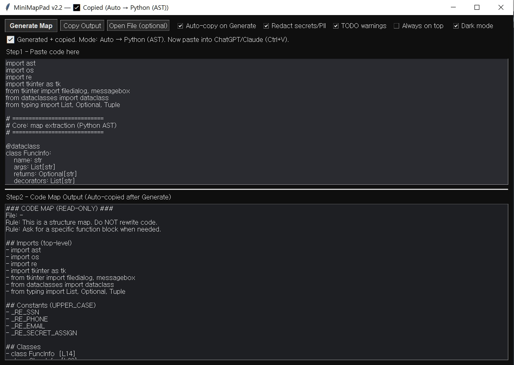

# MiniMapPad — Code Map Generator (Auto Copy)

<p align="center">
  
</p>

Generate a compact **structure map** from long source code, then **auto-copy** it to your clipboard for ChatGPT / Claude / Gemini.

**Primary:** Python (AST) / PHP (lite)  
**Secondary:** Kotlin / Java (lite)  
**Workflow:** Paste → Generate → Auto-copy → Paste to LLM

---

## What is a “Code Map”?

When you paste a huge file (1,000–5,000+ lines) into an LLM, it may hallucinate or miss important context.

MiniMapPad outputs a **read-only structure map**, such as:

- imports / namespace / use
- constants / defines
- functions + line numbers
- classes + methods + line numbers
- (lite) a few call hints (e.g., `->`, `::`)
- optional TODO/FIXME/HACK/TEMP warnings

**Rule:** This is a structure map. Do **NOT** rewrite code.  
**Rule:** Ask for a specific function/class block when needed.

---

## Features

- ✅ **Python AST mode** (accurate structure extraction)
- ✅ **PHP lite mode** (regex/token scanning, practical + low overhead)
- ✅ **Kotlin / Java lite mode** (line scan; should not block your workflow)
- ✅ **Auto mode**
  - Try Python AST first
  - If parsing fails, fallback to a lite mode
- ✅ **Auto-copy to clipboard**
- ✅ Optional **redaction** (secrets / basic PII patterns)
- ✅ Optional **TODO warnings**
- ✅ Dark mode UI

---

## Quick Start

### Option A) Run from Python
Requirements: **Python 3.9+**

```bash
python minimappad_v2_2.py
```

### Option B) Windows EXE
Download from **Releases** and run it.

---

## How to Use

1. Paste code into **Step1**
2. Click **Generate Map**
3. Output appears in **Step2** and is **auto-copied**
4. Paste into your LLM (Ctrl+V)

Suggested prompt for your LLM:

> Here is a read-only code map. Do NOT rewrite code.  
> Ask me which specific function/class block you need, then I will paste it.

---

## Language Support

- **Python (AST):** best accuracy
- **PHP (lite):** extracts `namespace`, `use`, `define/const`, `function`, `class`, `method`, plus small call hints (`->` / `::`)
- **Kotlin / Java (lite):** imports, declarations, fun/method signatures (best-effort)

If you paste non-Python code in Auto mode, Python parsing may fail and the tool will use a lite mode.

---

## Redaction (Optional)

When enabled, MiniMapPad will redact:
- emails
- KR phone number patterns
- KR SSN-like patterns
- common secret assignments (TOKEN / API KEY / SECRET / PASSWORD / etc.)

This is a best-effort safety layer, not a perfect sanitizer.

---

## Privacy

MiniMapPad runs locally. It does not send data anywhere.

---

## License

MIT
